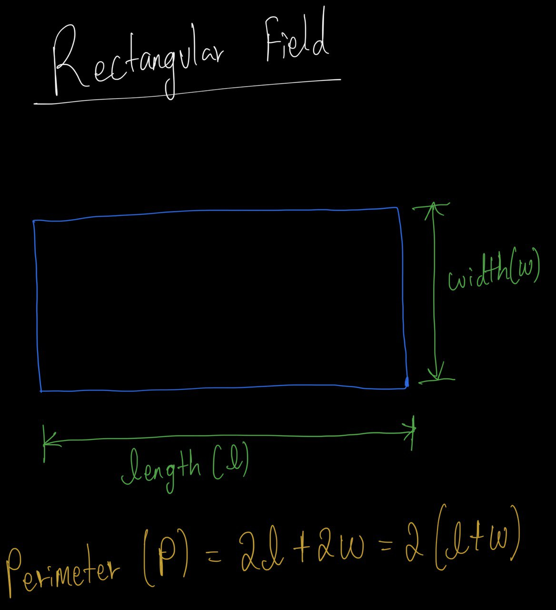

> The perimeter of a rectangular field is $628$ m. The length of the field 
> exceeds its width by $6$ m. Find the dimensions. 

--------------------------------

Recall the definition of perimeter: 

$2(l + w) = 628$

$\Rightarrow l + w = 314 \quad \quad (1)$

Since the length of the field exceeds its width by $6$ m, we have: 

$
l = w + 6 \quad \quad (2)
$

put equation $(2)$ into $(1)$: 

$l + w = 314$

$\Rightarrow (w + 6) + w = 314$

$\Rightarrow 2w + 6 = 314$

$\Rightarrow 2w = 308$

$\Rightarrow w = 154$

Thus the width is $154$ meters.

And the length is $l = w + 6 = 154 + 6 = 160 \text {meters}$

Note that the previous 4 questions (including this one) are what advanced mathematicians 
call **System of linear equations**. To learn more about 
**System of linear equations** (or **linear system**) head on over to 
https://en.wikipedia.org/wiki/System_of_linear_equations 