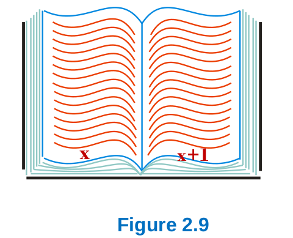

> The sum of the page numbers on two integers facing pages in a book 
> is $941$. What are the page numbers? 
> 

--------------------------------

$x + (x + 1) = 941$

$\Rightarrow 2x + 1 = 941$

$\Rightarrow 2x = 940$

$\Rightarrow x = 470$.

Thus the page numbers are $470$ and $471$. 
